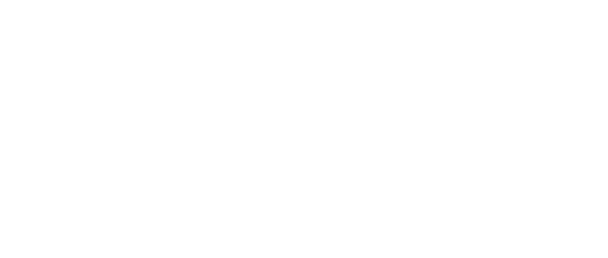
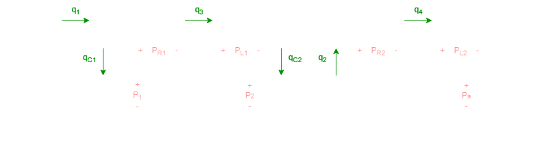

# Sistemi Dinamici

Questa repository è dedicata all'esame di Sistemi Dinamici ed i files sono organizzati come segue:

- **1. Trasformata di Laplace**: vi sono contenuti tutti gli appunti delle lezioni sulla trasformata di Laplace, compresi i teoremi e le proprietà.

- **2. Modellistica**: vi sono contenuti tutti gli appunti separati per tipo di sistema:

  - Sistemi elettrici
  - Sistemi meccanici
  - Sistemi idraulici
  - Sistemi termici

  Per ogni tipo di sistema è presente un file riassuntivo di tutti i sistemi visti a lezione, compresi di risposta nel tempo ed in frequenza, oltre che con rappresentazione nello spazio di stato, funzione di trasferimento e diagramma a blocchi.

- **3. Risposta nel tempo**: vi sono contenuti tutti gli appunti delle lezioni su questo argomento, oltre che ad una raccolta di esercizi.

- **4. Risposta in frequenza:** vi sono contenuti tutti gli appunti delle lezioni su questo argomento, oltre che ad una raccolta di esercizi e di esercitazioni fatte a lezione.

- **Esercizi:** In questa cartella è contenuto il file più importante di questa repository: `Cheatheet - Sistemi Dinamici.pdf`, in cui sono contenute tutte le nozioni più importanti di questo esame. Se conosci questo file, conosci l'esame.

- **MATLAB:** in questa cartella ci sono la maggior parte dei sistemi visti a lezione analizzati in MatLab, sia in frequenza che in tempo.

- **Risorse**: in questa cartella è presente un altro file molto utile: `Bode-schema.png` dove sono riportati tutti gli andamenti possibili dei diagrammi di Bode.

- **Simulazioni Esami:** in questa cartella ci sono diverse prove di esame svolte.

- **TESINA**: in questa cartella sono presenti tutti i files della tesina.

*Buona fortuna e buono studio.*

### Elenco delle possibili domande - Esame orale 2024

Usa questa lista per ripetere prima dell'esame orale!

- [ ] Rappresentazione dei numeri complessi nel piano (parte reale e parte immaginaria, modulo e fase)
- [ ] Disegno di un seno in funzione dell’angolo e in funzione del tempo
- [ ] Disegno di un coseno in funzione dell’angolo e in funzione del tempo
- [ ] Disegno della somma di un seno e un coseno in funzione del tempo
- [ ] Teorema di Eulero
- [ ] Teorema della derivazione reale **[IMPO]**
- [ ] Teorema del valore finale **[IMPO]**
- [ ] Teorema del valore iniziale **[IMPO]**
- [ ] Teorema dell’integrazione reale **[IMPO]**
- [ ] Teorema della derivazione complessa
- [ ] Trasformata della funzione traslata nel tempo
- [ ] Trasformata di Laplace dell’esponenziale
- [ ] Trasformata di Laplace del gradino
- [ ] Trasformata di Laplace della rampa
- [ ] Trasformata di Laplace dell’impulso
- [ ] Trasformata di Laplace del seno
- [ ] Trasformata di Laplace del coseno
- [ ] Scomposizione in fratti semplici
- [ ] Risoluzione di equazioni differenziali con la trasformata di Laplace
- [ ] Modello di circuito RC (funzione di trasferimento, schema a blocchi, spazio di stato)
- [ ] Modello di circuito RL (funzione di trasferimento, schema a blocchi, spazio di stato)
- [ ] Modello di circuito RLC (funzione di trasferimento, schema a blocchi, spazio di stato)
- [ ] Modello di circuito doppio RC in cascata (funzione di trasferimento, schema a blocchi, spazio di stato) **ELEMENTI IN CASCATA**
- [ ] Modello controllore proporzionale (invertente e non invertente) con amplificatore operazionale
- [ ] Modello controllore integrale con amplificatore operazionale
- [ ] Modello controllore proporzionale-integrale con amplificatore operazionale
- [ ] Modello di sistema massa-smorzatore (funzione di trasferimento, schema a blocchi, spazio di stato)
- [ ] Modello di sistema massa-molla (funzione di trasferimento, schema a blocchi, spazio di stato)
- [ ] Modello di sistema massa-molla-smorzatore (funzione di trasferimento, schema a blocchi, spazio di stato)
- [ ] Modello di sistema con due masse accoppiate (funzione di trasferimento, schema a blocchi, spazio di stato) **VISTO MA NON APPROFONDITO**
- [ ] Modelli serbatoi idraulici comunicanti (funzione di trasferimento, schema a blocchi, spazio di stato)
- [ ] Modelli termici stanza-radiatore (funzione di trasferimento, schema a blocchi, spazio di stato)
- [ ] Linearizzazione
- [ ] Ricavare la funzione di trasferimento dalla rappresentazione nello spazio di stato
- [ ] Stabilità di sistemi dinamici lineari tempo-invarianti: relazione tra stabilità, asintotica stabilità, posizione di poli nel piano complesso e risposta impulsiva.
- [ ] Risposta forzata (transitoria e di regime) al gradino per sistemi del primo ordine
- [ ] Risposta forzata (transitoria e di regime) alla rampa per sistemi del primo ordine
- [ ] Risposta forzata (transitoria e di regime) all’impulso per sistemi del primo ordine
- [ ] Risposta forzata (transitoria e di regime) al gradino per sistemi del secondo ordine al variare del coefficiente di smorzamento
- [ ] Specifiche della risposta transitoria per sistemi del secondo ordine: tempo di salita, tempo di picco, massima sovraelongazione, tempo di assestamento.
- [ ] Risposta al gradino per sistemi di ordine superiore al secondo con poli distinti.
- [ ] Evoluzione libera ed evoluzione forzata **DA FARE** lezione 19
- [ ] Risposta in frequenza **dimostrazione uscita steady state IMPO**
- [ ] Diagrammi di Bode di fattori integrali e derivativi
- [ ] Diagrammi di Bode di fattori del primo ordine, diagrammi asintotici ed esatti
- [ ] Diagrammi di Bode di fattori qua dratici, diagrammi asintotici ed esatti (pulsazione di risonanza e picco di risonanza)

## Tabella di marcia

Programma di Sistemi Dinamici

 

I paragrafi e le pagine indicati si riferiscono al testo K. Ogata, L. Biagiotti, “Fondamenti di controlli automatici”, V ed., Pearson, 2020. Il programma, oltre ad alcuni appunti integrativi messi a disposizione, consiste in: cap. 2, cap. 3 (escluso par. 3.5), cap. 4 (escluso par. 4.7), cap. 5 (escluso par. 5.6, 5.7, 5.8), cap. 7 (solo par. 7.1 e 7.2).

 

Lezione 1, 3 ore, 11-14, 26 set 2023.

Contenuti: Introduzione al Corso. Concetti di modello, sistema e feedback. Numeri complessi: parte reale e parte immaginaria, modulo e fase, rappresentazione sul piano. Teorema di Eulero.

Materiale: Lucidi. Par. 2.2, 2.3. Appunti sui numeri complessi.

 

Lezione 2, 3 ore, 11-14, 27 set 2023.

Contenuti: Trasformata di Laplace: definizione e ascissa di convergenza. Trasformate di esponenziale, gradino, traslata nel tempo, impulso rettangolare, funzione impulsiva.

Materiali: Par. 2.3.

 

Lezione 3, 3 ore, 11-14, 3 ott 2023.

Contenuti: Trasformata di Laplace: rampa, sinusoide, moltiplicazione per esponenziale, combinazioni lineari di gradini e rampe con traslazione nel tempo. Teoremi sulla trasformata di Laplace: derivazione reale.

Materiali: Par. 2.3, 2.4. Appunti su segnali combinazione di rampe e gradini. Appunti su rappresentazione sinusoide. Problemi 2.2, 2.3.

 

Lezione 4, 3 ore, 11-14, 4 ott 2023

Contenuti: Teoremi sulla trasformata di Laplace: valore finale, valore iniziale, integrazione reale, derivazione complessa. Anti- trasformata di Laplace: sviluppo in fratti semplici con poli reali semplici. Modi aperiodici. Esercizi sulla antitrasformata di Laplace.

Materiali: Par. 2.4, 2.5. Appunti su [modi naturali](https://handy.unisannio.it/mod/resource/view.php?id=6293) aperiodici e pseudoperiodici. Problemi 2.5, 2.7, 2.8.

 

Lezione 5, 3 ore, 11-14, 10 ott 2023

Contenuti: Anti- trasformata di Laplace: sviluppo in fratti semplici con poli complessi e coniugati semplici. Modi pseudo-periodici. Esercizi sulla antitrasformata di Laplace. Matlab: vettori, plot.

Materiali: Par. 2.6. Problemi 2.11, 2.12. Appunti [somma di seno e coseno](https://handy.unisannio.it/mod/resource/view.php?id=6170). Appunti su [modi naturali](https://handy.unisannio.it/mod/resource/view.php?id=6293) aperiodici e pseudoperiodici.

 

Lezione 6, 3 ore, 11-14, 11 ott 2023

Contenuti: Anti- trasformata di Laplace: sviluppo in fratti semplici con poli reali multipli e complessi e coniugati semplici. Esercizi sulla antitrasformata di Laplace. Matlab: comando residue, scomposizione in fratti semplici, zeri e poli.

Materiali: Appunti su antitrasformata di Laplace. Problemi 2.13, 2.14.

 

Lezione 7, 3 ore, 11-14, 17 ott 2023

Contenuti: Risoluzione di equazioni differenziali lineari tempo-invarianti. Esercizi. Matlab: comandi find, tf2zp, printsys, for, while.

Materiali: Par. 2.7. Appunti su antitrasformata di Laplace. Problemi 2.15, 2.16, 2.17.

 

Lezione 8, 3 ore, 11-14, 18 ott 2023

Contenuti: Sistemi dinamici lineari tempo-invarianti. Funzione di trasferimento. Ingresso e uscita di un sistema. Funzione di risposta all’impulso. Schemi a blocchi. Connessione di blocchi in serie, in parallelo, in feedback. Controllori P, PI, PID.

Materiali: Par. 3.1, 3.2, 3.3. Problemi 3.1, 3.2. Esempio Matlab su calcolo residui.

 

Lezione 9, 3 ore, 11-14, 24 ott 2023

Contenuti: Modellistica di sistemi elettrici: R, L, C. Impedenze complesse. Circuito RC: modelli con funzioni di trasferimento, nello spazio di stato, schemi a blocchi.

Materiali: Par. 4.1, 4.2, 4.3.

 

Lezione 10, 3 ore, 11-14, 25 ott 2023

Contenuti: Circuiti RL, RLC, RC in cascata: modelli con funzioni di trasferimento, nello spazio di stato, schemi a blocchi. Simulink.

Materiali: Par. 4.2, 4.3.

 

Lezione 11, 3 ore, 11-14, 31 ott 2023

Contenuti: Amplificatori operazionali. Funzioni di trasferimento con amplificatori operazionali. Schemi di controllori PID. Modellistica di sistemi meccanici con massa, molla e attrito: modelli con funzioni di trasferimento, nello spazio di stato, schemi a blocchi.

Materiali: Par. 4.2, 4.3, 4.4. Appunti su schemi a blocchi.

 

Lezione 12, 3 ore, 11-14, 7 nov 2023

Contenuti: Modellistica di sistemi elettromeccanici. Dallo spazio di stato alla funzione di trasferimento.

Materiali: Par. 3.4, 4.5.

 

Lezione 13, 3 ore, 11-14, 8 nov 2023

Contenuti: Linearizzazione. Modello di pendolo inverso su carrello.

Materiali: Par. 3.7, 4.4. Appunti su linearizzazione.

 

Lezione 14, 3 ore, 11-14, 14 nov 2023  

Modellistica di sistemi idraulici con due serbatoi in cascata: modelli con funzioni di trasferimento, modelli nello spazio di stato, schemi a blocchi. Modellistica di sistemi termici con una stanza e radiatore: modelli con funzioni di trasferimento, modelli nello spazio di stato, schemi a blocchi.

Materiali: Par. 4.2, 4.6, 4.7.

 

Lezione 15, 3 ore, 11-14, 15 nov 2023  

Contenuti: Trasformazione di modelli con Matlab. Simulazione in Simulink. Seminario sulle tecnologie dei sistemi di controllo.

Materiali: Par. 3.6, 4.8.

 

Lezione 16, 3 ore, 11-14, 21 nov 2023

Contenuti: Risposta forzata (transitoria e di regime) per sistemi del primo ordine: al gradino, alla rampa, all’impulso. Risposta forzata alla combinazione lineare di ingressi elementari.

Materiali: Par. 5.1-5.2.

 

Lezione 17, 3 ore, 11-14, 22 nov 2023  

Contenuti: Risposta forzata (transitoria e di regime) al gradino per sistemi del secondo ordine.

Materiali: Par. 5.3.

 

Lezione 18, 3 ore, 11-14, 28 nov 2023  

Contenuti: Specifiche nella risposta forzata al gradino per sistemi del secondo ordine: tempo di ritardo, tempo di assestamento, tempo di salita, sovraelongazione. Risposta all’impulso per sistemi del secondo ordine. Posizione dei poli nel piano complesso per sistemi del secondo ordine e relative considerazioni sulla stabilità e sulla risposta impulsiva.

Materiali: Par. 5.3, 5.4. Appunti sulla stabilità.

 

Lezione 19, 3 ore, 11-14, 29 nov 2023

Contenuti: Risposta per sistemi di ordine superiore al secondo. Evoluzione libera ed evoluzione forzata. Simulazione con Matlab/Simulink della risposta forzata di sistemi.

Materiali: Par. 5.5. Appunti su [evoluzione libera ed evoluzione forzata](https://handy.unisannio.it/mod/resource/view.php?id=7533).

 

Lezione 20, 3 ore, 11-14, 5 dic 2023

Contenuti: Risposta in frequenza. Diagrammi di Bode per guadagno e integratore.

Materiali: Par. 7.1-7.2.

 

Lezione 21, 3 ore, 11-14, 6 dic 2023

Contenuti: Diagrammi di Bode per sistemi del primo ordine.

Materiali: Par. 7.2.

 

Lezione 22, 3 ore, 11-14, 12 dic 2023

Contenuti: Diagrammi di Bode per sistemi del secondo ordine.

Materiali: Par. 7.2.

 

Lezione 23, 3 ore, 11-14, 13 dic 2023

Contenuti: Risposta in frequenza. di ordine superiore al secondo. Uso di Matlab per tracciare i diagrammi di Bode.

Materiali: Par. 7.2.

 

Lezione 24, 3 ore, 11-14, 19 dic 2023

Contenuti: Risposta nel tempo e risposta in frequenza. Esercitazione.

Materiali: Appunti per diagrammi di Bode

 

Lezione 25, 3 ore, 11-14, 20 dic 2023

Contenuti: Risposta nel tempo e risposta in frequenza. Esercitazione.