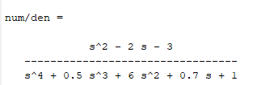
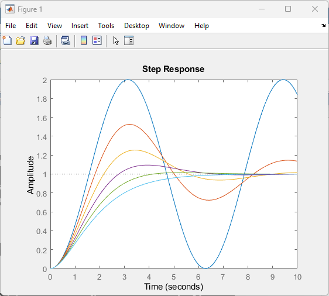
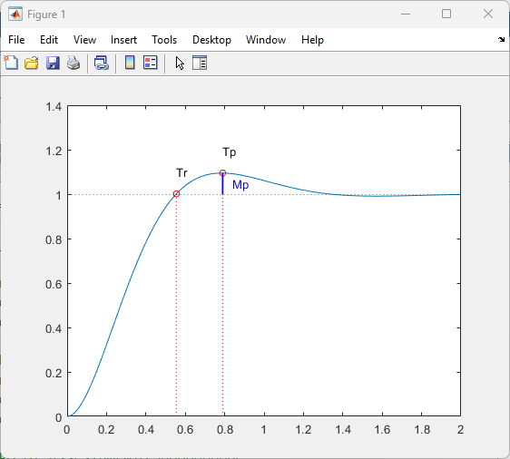
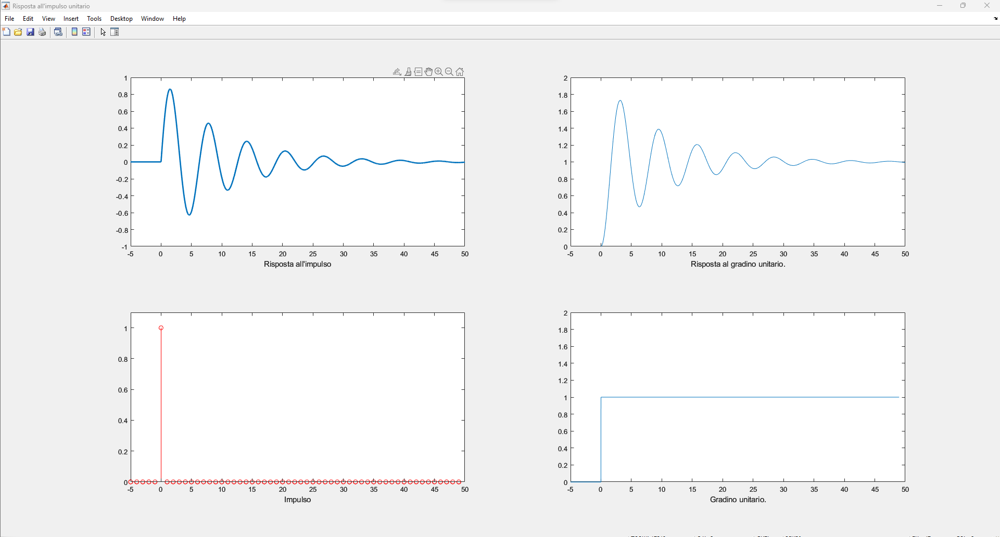

# SistemiDinamici
Repository dedicata all'esame di sistemi dinamici

## Cosa inserire nel progetto

- Primo lucido: il modello

- Secondo lucido: Risposta impulsiva

  - Facciamo vedere i singoli modi:

  1. funzione di trasferimento
  2. scomposizione in fratti semplici con residue()
  3. 

## MATLAB - codice utile

### Definire una matrice

```matlab
>> test = [1,1;2,2]

test =

     1     1
     2     2
```


### Definire un polinomio

Possiamo definire un polinomio andando a rappresentarlo tramite un vettore che riporta i **coefficienti** a partire dal grado massimo (da sinistra a destra); ad esempio possiamo scrivere

```matlab
num=[0 1 -2 -3];		% definisco il numeratore
den=[1 0.5 6 0.7 1];	% definisco il denominatore

printsys(num, den);		% stampo la frazione di polinomi
```



### Dalla funzione di trasferimento alla rappresentazione nello spazio di stato

```matlab
num=[0 1 -2 -3];		% definisco il numeratore
den=[1 0.5 6 0.7 1];	% definisco il denominatore

[A, B, C, D] = tf2ss(num, den);
```

### Dallo spazio di stato alla funzione di trasferimento

```matlab
[num, den] = ss2tf(A, B, C, D, iu);
```

**Attenzione**: `iu` deve essere specificato per i sistemi con più di un ingresso, se ad esempio abbiamo 3 ingressi possiamo scegliere tra i numeri 1, 2 o 3.

### Sistemi del secondo ordine

Dobbiamo descrivere un sistema avente una funzione di trasferimento generica del tipo:

![Time Response of Second Order Transfer Function and Stability Analysis](data:image/png;base64,iVBORw0KGgoAAAANSUhEUgAAAXwAAACFCAMAAABv07OdAAACc1BMVEX///8AAABJSUlZWVloaGhGRkYTExP/u26Hue4MYJ376tudWwAAVZTT5fnflUH8///b6vv0//////tGAAD///iampoACzig6e///+zo//////H28qbw//8AABAAAEIRAACSv++Dg4N1dXUxAAAAADwAABoAACUnAAAAACs8AAClpaVGGgD//+UAABYiAAD4883F7PTpoEwAAWXr1MRxMgAAAE3z+P8bAAD/6KFZJQAAEX5ukr/ar4+xXwAAACB1ntIAIjzzy3xwEAAAD2vy4td/OgAAAFqu0+Xb/////9D/16dQdp//yIThvqXFezRXfLMyEwAAJ0vg4OByv+zCnWC6//9quOxSia6scjtOmNwzNTW5ubnNzc1AJQCSbkK51fW6fzzp4JpZOxhhFAD/7dS8lncXV2x6osXDilQVI027sKV1UC53rNkAJ2G9oqT/0Jx9RSig4f/DtL4dV6apvsfg0bl+bmhseqWuhHPRnHAXABGliYZjY1FLOiQAIC9FWGBfcYP92LhnO0/Mr34vR3U2KUCGUwQleMisveTmxb6IfVAyJRTWwpqMZhyYvtpVU3eIY2aTZFGUzdkANGxjKRaHWzY/f6e84/9HMDh7UBoALImYnb6PLgCam4w7kt7arGMxYYp9gZQASpi53dsALHSmglhMXG+1ZzWbTgASSX/GpHfOpI3boW5tJgBGFSQZH0HHiWslNkZoUjoaHACEoKVoUh+1rIkiAilOhpaYcFVgSndSpsjc/Ngma4cAMD3DtXWidYeYhqNtXXjcjCpEACiYuLiRSCd8NiGzomGIqNqEhHJZgMLp2YhisPplQTqYcBW6tYjlz0kOAAAUM0lEQVR4nO1d+0MUR7buUpF1EsQ0LeltMwzyRgbm4shrQQQDIgPDa9krChoCM6IYghslhqjoLCTRyBJjgis+gTBIiMbgNSRcb9bdZZNrjDe7f9Kt6vdzhnmY6Yn9/cJM09Nd/fWpU6dOVX2FYQYMGDBgwIABAwYMGDDwawVl7+jo2PBSpIvxXMLlzgYAHOwx2P/lQR463NPRewRkvBHpkjyHcNTFxWOYbRz0/Ueki/LcgXqzhv7bv9/8mwgX5flF7VHz/0W6DM8tao8m/jHSZfAF01u/lR+yvvVKJEryDOAoOaZ4ul8W5MCNjZs3btx4fAP8gtvjJP8cePuEonjkOydei/+lSvcsgQ++G1nDJ0+eOg1oDJ05O4Z5/pQs+ic1PHKpUPkbwv1eT4QtJixwvf9BJON8qgwyb647VxiPnf/QAob2Xeg7J/yXaBB/E4EYTdgT/a6HbD22IYK3d/0ZWvxP3Nun3E0ApAmdPmJ7wZiGeyEepR5TqRLRBedHcf5Pemawvw/AJ2PCd6IsR0Q+sb68R9O8Sa8lolU2DPBcrIlgy2WdA6A5WXJoODWRI5wYBiM+un+OI+CNqGbf886Y/5OeGchD0N3LXDexvZxrSh0l5r0+fk0MFiXpOkb2A9vHl2jboSLj9vtTodN5TXbQ3s2Sbz0Akv7g6+ebPgWTu59V2Z45PG+/TP91PUmOxO1t4wDk7pFHjETDZZpRHLr/Y74v0CD3WVEETxs4E4NwYV1EYub+/QAcVkSSxKMTtKN3tQHgJ+1RD0CdPnOC8aghxePjNdtT1wHzWgZDEUms2Q7AKHPyL4rjVVvo+MtZAiRpD6IFoRCrEgLM4lTQF8k2Sw1Ei3Ni4b2zyCaKr1x4r64jkoG8NjwTiHwtp23qBOCq0BYTA+5MNPBzrX1csBTiuorbiizI4S7z7BhnH1XuLvBinB4TIdC0QXqdFneuaiBy+cRoSe7ZLVtunJaGptthgx3JbooC1sXsDMkjDUyATyIZzGuAGoaxTsYOjf/irycAcJP/6prIQCkeoqVNQv56AJIu6enRbsG6TFsD6Zxi6nRxAvhcHtBFHuRwpg/yCfgY4Pf8ufNFLzL2RMyJyc+HJ+3QUUfLkQMSe+hP9mqwjjnWAKMC3fl9aytkrkKrqcehRzHz5Ls6wTTrRyuTkoWzKi0ArNNPhoeCAdokbebUo1RQwHRSNiUAzQRVxOCH/DnoUV7mvpleAGnclzbRTyqLAP9WdID+LpDLeHwSPhzbQ7RehwaiN9O3tlp8kE9Vy8gHM5/RLONOkQeFVgVm9PNgg00go5Q2ckS+mQ2UYR2e0VVUgPnz+badYvKpQWjiQ98el4dGiPxXddPNIr15oOJH5iMkP5EtPowKCnQVFUBQ8yjaKdUolZR8zLMNjXRVnJXRry/yrV4LV5UR+azPR1FBmt7Ix5yQ0FytOF9GPu7oogcaK2bHxMGN3sgv4sinHmWCrWz/UZfkMz1cDepk5MMnu82M86Y3itjXLfnEaAKYZg/rknxUVs20pDTaYc6/fQE20cDcKCQdEPn6iXZE5KMhOi4rqEvyMeRKslTGCfHCeJp8Ic5nYXsHTXM4LOTSNmXriXzCncpHEFbvLq5GwgZ3piZihdICGshS6XtTb0K/TnTC//0nd4hoYeJJagANAQiTRlAn6wPdkI+V7efJp+ZnuHLBUPNF/YTDPDzdAJSXysjDv7gGj+BPM0W5HRc/2umAPxESmbHwVTzUT3oBVmVzHdPMutqy2Hprha3XZR2Sj70OGb4ny8jfmaXr68BdaNTcMVcb/4oaQLlg+cswoNNRzpBoA2CErsnE6JdN04xDrYQuX3fpBQQcpc/WSkbJY+8xHUPUqeVTyq7OAm7Ea1k8rwfVaD11Hjd1g3S6XprmLpc10c9l/QGY9+hzpBmHbhJaC0+g6/ZW9rMoNUUn1tgUZ223aPAL1mizvgZTijNpHzOaDZuyQ+BYHDZaotuhTgjPxxfQCNWDz1paWnq/NgudLjSfihtGRMNaYBKe4swGB4UWGgY7iskPEYbnPnqcdJTbpL5ChgUWOPMgWgoxCg2E6ghU75P7/0X3n3IXpkTOkXRnAs4hubyzb/9Mn3RwSjToG6vDVDnh3Lx5ih1HHDgJP7PWYbJ7C2qq/gWfQEeNFARh792C8JbUfcMe8DQ3d61jA9ZCn1Qjim2o26BZb+PnWiBgNSi48eTBja/BZV3Zvgaowbw0nzPSinNAo37iTN8gzi8mJDbWxOPD2frJh/gCDBQafTSnxGBRgc8ZbfqCqboAVVP7tq1RQT6MHXzNSHNMgGiaqllVvQslGaKGfKzeojKpioXN629Cm76AyI+PJvKx4abLGh0Uav4brVEwfSL6yMdHj3yr2oUl3TE90RA1CIg+8jHCtvSRSj/K9uE/xqIl0GHB+/zoiHYYmJz/rfA8tRd7ClW6KuTiGlVc00MKYuAuPbnOvq3gZf8n6wa4kmeVQwhWL1DF53pIbFVawMN4jGiFfyJdlOcOc0P79l24+j876T96qIkGDBgwYOB5QErMqnAipp2+qtV9JUYNJ9hopz28d40ixKSIuFcPCUNAB02+N3OtCnLZGQUdYb9rFEHM/uqwYlX7iupb+6rw3jaKkOKfHQMGDBgwYMCAAQPhh6kFaanraipTqMCr4CPpa3KcOlzeVNgJ+U6XM4mDBOEch4/01z26HzOzbh8Za7/RpT/xmOCBOz6ta29fyjTrbjKlHPXrCl/C8NejWjJMBmL+R+hxTI/ysnQ+0E3+jambsVEsGSaH7e/0UJmrU0/CFL5QnPfrIZ8F1WoJmXyiRbFgkWoJe3WqTdCeHOcfpg4dagtTj/JCFR6tOvmRwhlbL/aEezVQPWgMmj9iYHyGXQfXflw/bZypc5fGWgBi4ORGEbZsaf9M7S0Ro7MPVHg2LX1UE1ZbwxsKVjjrljyPyvuWiGN8tGSSXmhL9R4AfcnhLFZIcN3do+F1cFMHWlQrYO2ZlGsK+vHWBfW9jKjF98K6yZGje+/K4nznKbTuB9ybFdZEkp1JNPcuJMMdivMKL/BbPtdM4S/Ax1gXhyQbe3MAUnKX19n1GVoUW1stK6RrJbC2HVvZxdav5YzFPM2xb2qg9XRMbfBouX52Xtr0pW/FzljAqzAhiSyFJFM+0F5saPMCX0rLgaHsRfUKisteCSowGpmk6efmPlGtWZdeoteuAt9LaQKD/N6BYs7PLG4R+RhBy4pIDKcfjPioxI4J8Psw2b7zH+odcdPctKTBqe0Gs2OwrbEt0b6Hq3qmtvKelhfAwqrGcLa2y+mhaM0SDf6WTInJx2wJImuiD5QAX56FPGRJCk/ywnNSQ5jC9IJkjTVxB7Bj8ZjnCCxsM2fnrsUJMDk1Ft4ezfrEEMin7tT5axIl5KP15CBLmMJLei1pPif0Fn/qc83WiuF5m9FSxxXkyci3TRzjQiwcrW5mNb1QWTvDr2EXCvlU2QPaSogW7XMk5OPrUVXmlUbQ4x3z+faI8CwFdWxm6o9nShEcyMjvFy0VQErQvEIcNfgMJOxCIJ/jnhr24fel5COJUkHIdAUq4rHhWP3v2FZ+hp5dcaVUcS0Z+YONorqBpATZR8NH/3kp1GIoETz5+J2cBfqRTiX5EPqRup1lAETbFdi38eKIWii2hL78nxVvgzicrPinjHxM3AKV5QiyUtU3n0ECK3jy8/nOk6/cjrTB7UbfuH8hfT5J64vECMHkuRaRqCl1HZQ/DNj0ydGj8EoL1zasv+nvVDn5YpQ1cTu6UI+3Kg0MLyybGLqHKiYx/G5Tc2mhJg3U6MewPEOlcZKKpUo+3uI9PfQNMknb0tqmyTH1NSIrhJh8qgF+meHDF9OcWEUcHzgKZlNSUO9SpiL+eaDO1rUEFlJSUpBgWCjkI2kIdospV7WyG0/O56SffY09HH/+neysRg32SbelYg18NCAXzVKS7zoADvNJrfgv7oO+cyH08kXkm+bh55Fk7vZyFfEDZrQqkWofl5C/HLheKNEKvkN2WrXUFBL5sMHNYrwifmuXotm3eTMTS0XE4GUlWkKKlZaDNWjo42SJH/IJaICfiKuY1ZudGEKOhSOfHLhx3wKyvhVkLWgVcT7yoeZTp9m0YbVcRTzArKkjgX0Ak9eyEvK1IkjPBBeLWa9Pyt8Q3gnAZdofWnunGL9YmZdbp2b7truJb9DmQ7izfZPvmuAk/2ybj9Mhr81ryQo+nYHIr1i9Zs2p00Vrz3wvHm3HG2Qq4tx2cFIVcUVd9Yt8vo125KiTb/1CWMe4v+IM/1liZOR83i62912cWSpPsNbngT7mLmU5ZoYecg7k7lApaj1oZnsLrj9/UIjbLvL368qd5T+f+C1mOmQB00wRljlZQLS1SdCJvFghqSkT0VSoiHMaF8RRsYq4JWBpx2WQdollsUGD/APqk6wl+X57NZ/bWE76UXYFihcOR1KbzFpI/GkquKrieGJBORcuwwYXf2pRvffW3dhANxd613aDrLFXmMtbhL0NA0UsEw3R2c2rEt9NyMkHV3fTJ+B3koWzghA1XUYql0x56/0m5jTdjqkB7OXuO6cYf4SPlciwg7pi7EJURJ7K24bn9rHaog7pmvp8iduBd+QMEEbYWQ/pnyAlzwr53VcKzue/jqLMveJXKJXzNSEFzr/2KMYTg5DzRW0JuLzC+USaDe7TIj5Ctu5UZP8gT0nMNCBEPhuQVlXLDYyGA+3D812HStAo9fmmaj70huRz2V7Y2dAUYvcHjnxicD8A5WIBWbmKeAnirPmBbPgqCPJdc+hKGd8eXwn9WuR7uj/nw45NqfIwxvoDv/GdiHykE7dVOTsFNW6IfuXwo5R8FP2xoTckP50dyunvAunB5rf4UNOEdJXFFiQjnxqmxeIQ/SGqiOOer+kr3ZPLwatBg3wYcgkhX7Fiwk/t//JCuSK3g8hXE2fyME1MuaI8MvKzYWzBVA/kdsZYTyXIqAYMIc5HKVrxQJZcRZwa+IFpehZ6RBU0GBVx3OXNo69U4X/EXJ18W1vSy0Ihii3ypxeTD1tEdqsdLfIx12ICQ7+sBmmSvykbejXGBsNDPr1XH9tKIRDV8gAIt12ny5goYj84FXGck4P3Gyiokk96s5JFX4stcrcjIp9C/WD2WlrkYzg5mE2XZ1pCoyb51p383MYwkY+hNrWPT5OpqYjjtiPQOYmlr4OWcLctoXbO7E+qSo18a6u0XD7JRzbFnq1NPoa6DShzJegXI2iSDyM2bpg+XOTbqsVZNgK1Q/xD4mx0QpV1Ab6xwYJSETcxp+POI/C3I37KrUK+9fE3wnxmVK7ivJFk6SkUrFjc1u228VfZe9D7DSqbGRP7xJ4ltAO5+OVIyXfdBfx2CMXvcsL3kPyM0iADfUlWsx9FNHvYK+GVeWIV8ZOctfdni1XEKwNPL+RzkZlrHPjcaBpBSb71cZrohp6Lr8EujyLBAg2H8wtkG5cdrBKLQwuI5aydgj1YSQ5dSn4VdAWczGjtP7luXdl+UBFqqMkA7deXxuWoUJ9EpCLOP/F2sX5+EIm1fN5JDDb5t3zZADpGPj78G36H9njn+OXdyEHKA/16YVMGx0QBez+UMVfp1dX3ceVxbgOJYstfzpDE+chrsadWWlj7Q52sZj+DHppA5At9SBLNHuHqa9WcREV8hjP9ZZAoUREPNKWcn/Qj+3Pojv3tA4zbayROjXRbms9uZvEkJScNNf6xoHx2THIhcienM0wN3mv6iemZ31LfLqse/MTas+d9aT/ALtnNFXfy6QXr9YwRIZJdF+zMPeTYRapX9BY2h3fQVyMf5wllga/98B/ZG7MK9fSjwfhnT4AD1/ngHhOmkbBrEaA2pA31RsSgi4JyH0NnVq9Zs3r16lkmQ/A0E0Zu9BPdfZjPZAI9d0G52j4L9SCDMWNiOMFnjhtt6sbUkltpNZ20yRJfZMtzYivHV3QWqVmIXpwlTCiP7mHfBnL5qRlIRRwpodu7xPn82gS+oqwYKAs9+Rma7bmCwRQpbHIVsXSmpzDaLTpGezWUEM94iBGL2ZCkubQdhVhlKlCfAFaP3uHxeAx3F/mZTU/3lmtQ3m8vZi+5moxRrUWioCQQEI++3LePUcTYt2+W5Z90x9AHLtxkMnacZbraFmKu0M82NCtycbHcBqgBID9r1RX6necuBFhuYvRnqWpJzGwy8x9Ghp4B4+xx52lUSXKR87GN05scsZNOcbt3627Tv+CrYJiuh+UpYruPfkIH0k3fZmgvHawxbNDE4bhnW+MroyVgKGwLy9BwBTclrDcOO3/jSUrK5jGRh8PR1JFA71Z2jrlSylgYVwFRA+iKqBn4mhOVN72ZkjLFODjCuRl+ZqzE9FUTePXf42dPXWCHihw7sKpe9OsHK+ip20/CCzGGaoIfU64xL9A+DtLr/n0q5T5oDtc0XeiUk3yriIdp0lQ4MTrhez6F6c0PMwtO1MTDeq2S4gwOxPnFT82fQF9dm5MYNpVd21GfCxbwO3m+X04kQNya8TOZxVmyC5W6LOd3YTSc26ARVeS5rGB7XErUixtjBWzjYZsoGz4Qj/yT/zvEU3jJb2D2zdseRvJhaKKduCDniwKMVn4JEOvX+XG7UUM+dktzgj4xn3pTV3aPF6LRKFtCjx9Oo4d8YrjpgWoZCWeJvvYeIedA8/ctA9f9zl+MHvIxavTnEyp9WOvizzpTcN/EjIg0j/nr7UcR+RhW5T6h8PtW91Sczha2U6i7Xl533G+mxZmzFaXPynJUBnSDBezx0EH39nLlTOvQQCgXGJMd+jJ7BFMHEo7xexqME9BWL2i/9PDFybVHwUHYR6stAd/pXmgkgkBZfZDbaEN7umcpZroFiTKUEuv73o0mGfTpaw80AwYMGDBgwIABAwYMGDBgwIABAwZ+Bfh/HJ1ssPE0s3AAAAAASUVORK5CYII=)

```matlab
%Definisco la funzione di trasferimento del secondo ordine
wn = 5;                                 % ovvero omega_n
damping_ratio = 0.4;                    % ovvero zita

[num, den] = ord2(wn, damping_ratio);   % definisco numeratore e denominatore tramite la funzione ord2()

printsys(num, den);                     % questo comando ci restituisce la funzione di trasferimento senza il wn al num

% dobbiamo quindi moltiplicarla per wn^2 (ovvero l'ampiezza):
num = num*wn^2;
printsys(num, den)

sys = tf(num, den);                     % definisco il sistema tramite la funzione tf()
[y, t, x] = step(sys)					% Con la funzione step() posso ottenere la risposta al gradino (y) e l'asse del tempo; posso poi effettuare il plot:

plot(t, y, 'r', 'LineWidth',1);			% visualizzo la risposta in colore rosso ('r') e con uno spessore 1.
```

#### Plot per diversi valori di zeta

```matlab
clear
clc

% Lo scopo del programma è quello di visualizzare una funzione di
% trasferimento al variare di zeta; siamo nel caso sottosmorzato quindi
% zeta va da 0 a 1  (estremi esclusi ma li includiamo per vedere tutti i
% casi, tranne quello del sistema instabile).

t = 0:0.1:10;
num = [0 0 1];
z = 0:0.2:1;            % creo zeta da zero ad 1 con incrementi di 0.2


for i = 1:length(z)             % scorro su tutti gli zeta
    den = [1 2*z(i) 1];         % denominatore dato dalla traccia
    sys_n = tf(num, den);       % definisco un diverso sistema per ogni zeta
    step(sys_n, t);             % stampo l'uscita per ogni sistema
    hold on
end
```

Output:



### Calcolo dei tempi di risposta

```matlab
clear
clc
global MAGNITUDE
MAGNITUDE = 0.005;

% L'bbiettivo è di trovare il tempo di salita, tempo di picco,
% sovraelongazione massima e tempo di assestamento di un sistema del
% secondo ordine

num = [0 0 25];     % --> wn = 5
den = [1 6 25];     % --> z = 0.6

sys = tf(num, den);

t = 0:MAGNITUDE:2;
[y, t, x] = step(sys, t);

plot(t, y);         % disegno
xlim([0 2]);        % limite asse x
ylim([0 1.4]);      % limite asse y
hold on             % da questo momento scrivo sullo stesso grafico

%########## TEMPO DI SALITA ##########

% Trovo il tempo di salita: ovvero il tempo che la risposta impiega ad
% arrivare per la prima volta al valore di regime.
% Siccome il valore di regime della risposta sarà 1, allora ci basta
% trovare l'indice del primo valore maggiore di 1:

r = find(y > 1, 1);     % trovo l'indice del primo elemento di y che è maggiore di 1, potrei farlo anche con un while.

% di conseguenza il tempo di salita in secondi
rise_time = (r-1)*MAGNITUDE;

yline(1,':')                                    % disegno una linea orizzontale per demarcare il valore a regime
plot([rise_time rise_time],[0 y(r)], ':r');     % disegno una linea verticale che rappresenta il tempo di salita
plot(rise_time, y(r), 'ro', 'MarkerSize',5)
text(rise_time, y(r) + .1, 'Tr');

%########## TEMPO DI PICCO ##########

t_max = find(y == max(y));
y_max_coord = y(t_max);
x_max_coord = t_max*MAGNITUDE;

plot([x_max_coord x_max_coord], [0 y_max_coord], ':r' );
plot(x_max_coord, y_max_coord, 'ro', 'MarkerSize',5)
text(x_max_coord, y_max_coord + .1, 'Tp');

%########## SOVRAELONGAZIONE MASSIMA ##########
plot([x_max_coord x_max_coord], [1 y_max_coord], 'blue', 'LineWidth', 1.3);
Mp = y_max_coord - 1;
text(x_max_coord + 0.05, y_max_coord - (Mp/2), 'Mp', 'Color', 'blue');

%########## TEMPO DI ASSESTAMENTO ##########
max_percentage = 5;
% DA CALCOLARE!!!


%########## FUNZIONI ##########
% posso calcolare tutti i valori con la seguente funzione
s = stepinfo(sys)		

```

**Output: **



## Visualizzare due diverse risposte 

File di riferimento: `ES5_5_onRoids.m`

```matlab
clc; clear all; close all;

% Esempio 5.5 - L'obbiettivo è ottenere la risposta del sitema, dato dalla
% funzione di trasferimento, all'impulso unitario.
main_figure = figure('Name', "Risposta all'impulso unitario", 'NumberTitle','off');
MAGNITUDE = 0.01;
before_zero_amount = 10;

t = 0:MAGNITUDE:100;                     % ATTENZIONE - la simulazione arriva fino a 100*0.01 ma la visualizzazione fino a 50!
num = [0 0 1];
den = [1 0.2 1];


sys1 = tf(num, den);


%##### RISPOSTA ALL IMPULSO UNITARIO #####
[y, t, x] = impulse(sys1, t);
signal_before_zero = zeros(10, 1); % creo un array di 100 elementi tutti a valore zero


signal_before_zero = zeros(before_zero_amount/MAGNITUDE, 1);
t_before_zero = (-before_zero_amount:MAGNITUDE:(0-MAGNITUDE))'      % l'apice indica il trasposto, rende il vettore riga un vettore colonna

t = [t_before_zero; t];
y = [signal_before_zero; y];

subplot(2,2,1);
plot(t, y, 'LineWidth',2);
xlim([-5 50]);                       % visualizzo fino a 50
ylim([-1 1]);
xlabel("Risposta all'impulso");

subplot(2,2,3);
impulse_values = zeros((50+5), 1);
impulse_values(6) = 1;              % l'indice corrispondente a zero è proprio 6.
impulse_time = -5:1:49;

stem(impulse_time, impulse_values, 'r');
xlim([-5 50]);                       % visualizzo fino a 50
ylim([0 1.1]);
xlabel("Impulso");


%##### RISPOSTA AL GRADINO UNITARIO #####

% risposta
[y_step, t_step, x_step] = step(sys1, t);
subplot(2,2,2);
plot(t_step, y_step);
xlim([-5 50]);
ylim([0 2]);
xlabel('Risposta al gradino unitario.')

% gradino
step_time = -5:0.01:49;
step_signal = zeros(length(step_time),1);
step_signal((5/0.01)+1: end) = 1;

subplot(2,2,4);
plot(step_time, step_signal);
xlim([-5 50]);
ylim([0 2]);
xlabel('Gradino unitario.')

```

**Output:**



## Chicche

### DrawLabel

Questa funzione permette di scrivere un label in corrispondenza di una curva e di farlo ad un determinato offset.

```matlab
% questa funzione serve a disegnare un label in corrispondenza della
% curva. Accetta tre parametri:
% - array: l'array contenente la curva
% - tolerance: quanto vogliamo vicino il label
% - label: il testo da disegnare
function nienti = drawLabel(array, tolerance, label, x_pos, t)
    y_coord = array(t==x_pos);    %t==5 corrisponde a find(t==5)
    hold on
    text(x_pos, y_coord+calculateOffset(array, tolerance), label);

    nienti = 1; % ok
end

% questa funzione serve a calcolare l'offset massimo della curva
function offset = calculateOffset(array, tolerance)
    % calcolo la distanza dalla curva a cui voglio posizionare il testo.
    M = max(array);
    m = min(array);
    distance = M-m;

    % voglio che il testo sia al 5% di distanza dalla curva rispetto alla sua
    % escursione (tra max e min)
    offset = tolerance*distance;
end
```

## Visualizzare un segnale nullo prima di t = 0

```matlab
close; clear; clc
MAGNITUDE = 0.1;
SIGNAL_BEFORE_ZERO_VISUALIZATION = 10;   % Il valore minimo per cui si vuole visualizzare un segnale nullo primad dello zero.

t = 0:MAGNITUDE:100;                     % ATTENZIONE - la simulazione arriva fino a 100*0.01 ma la visualizzazione fino a 50!
num = [0 0 1];
den = [1 0.2 1];

% L'importante è che la lunghezzxa di signal_before_zero e di t_before_zero
% siano la stessa!
signal_before_zero = zeros(SIGNAL_BEFORE_ZERO_VISUALIZATION/MAGNITUDE,1);
t_before_zero = (-SIGNAL_BEFORE_ZERO_VISUALIZATION:MAGNITUDE:(0-MAGNITUDE))';

sys1 = tf(num, den);
[y, t, x] = impulse(sys1, t);

t = [t_before_zero; t];
y = [signal_before_zero; y];

plot(t, y)
xlim([-10 100])
```

## Link utili

- Disegno di linee e stili - [Link](https://it.mathworks.com/help/matlab/creating_plots/specify-line-and-marker-appearance-in-plots.html)


## Programma del corso

