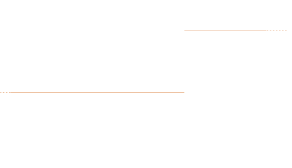

# Tesina Sistemi Dinamici


## Schema del sistema


> Schema del sistema idraulico composto da due serbatoi.

### Circuito Equivalente

E` possibile rappresentare lo schema idraulico in termini di **circuito elettrico**, con le componenti che conosciamo, andando a sostituire:

|   Schema Idraulico    |    Schema Elettrico    |
| :-------------------: | :--------------------: |
|       Serbatoio       |      Condensatore      |
|       Rubinetti       | Generatori di corrente |
| Pressione atmosferica | Generatore di tensione |
| Resistenze idrauliche | Resistenze elettriche  |
| Induttanze idrauliche | Induttanze idrauliche  |

Bisogna tenere a mente diversi accorgimenti:

- Come nello schema idraulico, le resistenze ed induttanze vanno poste tra due serbatoi (condensatori).
- Tra un serbatoio e l'altro, se connessi, scorre un flusso q<sub>n</sub>; nello schema elettrico questo si traduce nel flusso, elettrico, ovvero in *corrente elettrica*.


> Circuito equivalente

### Equazioni del sistema

A partire dal circuito equivalente è possibile estrapolare le equazioni del sistema, che lo descrivono:
$$
\begin{equation}
    \begin{cases}
      C_{1} \cdot \frac{\mathrm{d} }{\mathrm{d} t}P_{1} = q_{1} - q_{3}\\
      C_{2} \cdot \frac{\mathrm{d} }{\mathrm{d} t}P_{2} = q_{2} + q_{3} - q_{4}\\
      L_{1} \cdot \frac{\mathrm{d} }{\mathrm{d} t}q_{3} = -R_{1} \cdot q_{3} + p_{1} - p_{2}\\
      L_{2} \cdot \frac{\mathrm{d} }{\mathrm{d} t}q_{4} = -R_{1} \cdot q_{4} + p_{1} - p_{a}\\

    \end{cases}\,
\end{equation}
$$


Ricordando la natura del sistema, possiamo identificare i valori di input:

- **Input:**
  - q<sub>1</sub> : flusso in immissione tank 1
  - q<sub>2</sub> : flusso in immissione tank 2
  - P<sub>a</sub>: Pressione atmosferica "a valle"; Se si considera questa pressione molto più piccola rispetto alla pressione alla base del tank 2, la si può ignorare.

### Modello nello spazio di stato

Possiamo quindi partire dalle equazioni del sistema e rappresentarlo nello spazio di stato, andando a scegliere **Variabili di stato**, **Entrate** ed **uscite**:
$$
\begin{equation}\\Variabili \ di \ stato
    \begin{cases}
x_{1} = P_{1}\\
x_{2} = P_{2}\\
x_{3} = q_{3}\\
    \end{cases}\
\end{equation}
$$

$$
\begin{equation}input
\begin{cases}
u_{1} = q_{1}\\
u_{2} = q_{2}\\
u_{3} = P_{a}\\
    \end{cases}\,
\end{equation}
$$

$$
\begin{equation}uscita
\begin{cases}
y_{1} = P_{1}\\
    \end{cases}\
\end{equation}
$$

Possiamo scrivere sottoforma di matrice:


Possiamo inoltre "scegliere" l'uscita del sistema che vogliamo monitorare, per questo esempio scegliamo la *pressione P<sub>1</sub>*, che per semplicità coincide proprio con la variabile di stato *x<sub>1</sub>*:


#### Funzione di trasferimento calcolata con MatLab

Siccome la funzione di questo sistema risulta complicata da calcolare "a mano", possiamo servirci di **MatLab**, che una volta immessi i parametri del sistema tramite spazio di stato, può restituirci la **Funzione Di Trasferimento** *numerica* del sistema:

##### Immissione delle matrici

Dopo aver dichiarato i parametri, possiamo immettere le matrici appena trovate all'interno dell'ambiente MatLab; queste equazioni descrivono il sistema.

```matlab
A = [   0,      0,      -1/C1,      0;
        0,      0,      1/C2,       -1/C2;
        1/L1,   -1/L1,  -R1/L1,      0;
        0,      1/L2,   0,          -R2/L2
    ];

B = [   1/C1,   0,      0;
        0,      1/C2,   0;
        0,      0,      0;
        0,      0,      -1/L2
    ];

C = [1, 0, 0, 0];
D = [0, 0, 0];
```

##### Calcolo della funzione di trasferimento

Con i seguenti comandi possiamo trovare ***le*** funzioni di trasferimento associate ai diversi input:

```matlab
G = ss(A, B, C, D);         % Sistema a partire dallo spazio di stato              

TFs = tf(G);                % Funzioni di trasferimento per i diversi input
```

Possiamo accedere ad una delle funzioni di trasferimento con il comando `Tfs(k)`; viene di seguito riportato la FDT numerica associata all'input 1:
$$
G(s)_{1} = \frac{0,01s^3+0.02s^2+0.01s+16\cdot 10^{-4}}{s^4 + 2s^3 +1.03s^2+26\cdot10^{-2}+8.3\cdot10^{5}}
$$

## Risposta del sistema nel tempo

Dopo aver rappresentato il sistema nell'ambiente MatLab, possiamo iniziare ad ottenere informazioni sulle possibili risposte del sistema.

La prima cosa che possiamo fare è controllare la posizione dei **poli** e degli **zeri** nel piano complesso; questo è possibile tramite il comando 	`pzmap(G)`, che restituisce il seguente grafico:

 

Dopo aver visualizzato i diversi poli e zeri del sistema, possiamo passare a trovare l'uscita del sistema ad un segnale; siccome il sistema è composto di 3 input, nel momento in cui calcoliamo `step(G)`, ovvero la risposta ad un segnale gradino, matlab "mette in ingresso" un gradino unitario **a tutti e 3 gli input**. 

Capiamo quindi che questo modo è un po' troppo limitante per il calcolo dell'uscita.

Possiamo però "costruirci" un segnale custom da utilizzare come uno (o più) degli input del sistema; vediamo come fare:

### Risposta ad un segnale custom

La prima cosa da fare è sicuramente quella di costrire l'input personalizzato; vogliamo realizzare un segnale gradino che parte da un'ampiezza 1, e che varia di ampiezza (arrivando a 2) dopo 500s:



Possiamo scrivere il segnale come somma di segnali elementari:
$$
\begin{cases}
    u_{1}(t) = {\bf 1}(t) \\
    u_{2}(t) = {\bf 1}(t-500)
\end{cases}
$$

$$
u(t) = u_{1}(t) + u_{2}(t)
$$

Possiamo trasformare il segnale nel dominio di Laplace ottenendo:
$$
\begin{cases}
u_{1}(t) \longleftrightarrow U_{1}(s) = \frac{1}{s}\\
u_{2}(t) \longleftrightarrow U_{2}(s) = \frac{1}{s} \cdot e^{-100s}\\
\end{cases}
$$

$$
U(s) = U_{1}(s) + U_{2}(s)
$$

Possiamo quindi costruire il segnale su MatLab "pezzo per pezzo" nel seguente modo:

```matlab
U21 = 1/s;                                  % Gradino unitario
U22 = tf([0 1], [1 0], 'inputDelay', 500);  % Gradino ritardato di 100
U2 = U21 + U22;                             % Trovo il segnale risultante
```

Per trovare l'uscita ci basta quindi moltiplicare il segnale (nel dominio di Laplace) per la funzione di trasferimento (che abbiamo ottenuto tramite lo spazio di stato); bisogna stare attenti però a "selezionare" la funzione di trasferimento giusta, perchè come abbiamo già visto, le FDT sono 3, una per ogni input.

In questo caso vogliamo che il segnale sia attribuito all'input 1, ovvero al flusso del tank 1, quindi scegliamo la FDT 1:

```matlab
Y3 = G_default(1) * U2;						% Calcolo l'uscita nel dominio di Laplace
[y2, t2] = impulse(Y3);						% Calcolo l'antitrasformata
```

Possiamo calcolare l'antitrasformta con `impulse(Y3)`, perché nel dominio di Laplace l'impulso corrisponde ad `1`, quindi moltiplicando per 1 il segnale *Y(s)* non cambia; successivamente provvede MatLab ad *antri trasformare* (sempre con impulse).

### Plot dei singoli modi

Possiamo quindi effettuare il plot dei singoli modi e dei segnali totali:


> - **Plot 1**: modo dall'input 1 gradino unitario (q<sub>1</sub>)
> - Plot 2: modo dall'input 2 gradino unitario (q<sub>2</sub>)
> - Plot 3: modo dall'input 3 gradino di ampiezza 5 (P<sub>a</sub>)
> - Plot 4: 
>   - In Blu: uscita totale dei segnali 1, 2 e 3.
>   - Il resto dei plot sono i singoli modi.
> - Plot 5: uscita totale agli input:
>   - in 1: gradino che inizia unitario e cambia valore in t=500 arrivando ad un valore pari a 2.
>   - in 2: gradino unitario.
>   - in 3: gradino unitario.


### Risposta del sistema al variare dei parametri

#### Risposta al variare della capacità

In questo esempio facciamo variare la capacità del tank 1, con il seguente codice:

```matlab
for i=1:n
    G_capcity_1 = ss(A, B, C, D);       % Rappresento il sistema con il valore di C1 corrente

    [yn, tn] = step(G_capcity_1);       % Calcolo la risposta al gradino unitario
    yn_sum = sum(yn, [2 3]);            % Sommo le uscite dei 3 ingressi
    plot(tn, yn_sum)                    % Disegno le diverse uscite
    hold on;

    C1 = C1 + 50;                       % Aggiorno il valore di C per la prossima iterazione
    [A, B, C, D] = updateMatrixes(C1, C2, R1, R2, L1, L2);  % Aggiorno le matrici con il valore di C corrente
    legend_text{i} = sprintf("Capacita' = %i", C1);         % Attribuisco ad ogni curva un nome per la legenda
end
```

Andiamo quindi, ad ogni iterazione, ad aumentare la capacità del serbatoio; possiamo notare dalle curve, che man mano che la capacità aumenta, la pressione del sistema impiega sempre più tempo ad arrivare a regime.

Notiamo, però, che il *valore* di regime resta invariato.


#### Risposta al variare dell'induttanza

Allo stesso modo possiamo far variare l'induttanza; ad ogni iterazione variamo di un valore maggiore, in modo da ottenere un risultato più "interessante":

INSERISCI RISPOSTA AL VARIARE INDUTTANZA

#### Risposta al variare della resistenza

##### Resistenza condotta 1

Se la resistenza della condotta 1 aumenta, allora la pressione sul tank 1 aumenta, perchè il liquido avrà maggiore difficoltà a spostarsi dal tank 1 al tank 2, infatti:

INSERISCI RISPOSTA AL VARIARE REISTENZA 1


## Richieste

La prova orale consiste nella presentazione di un esempio simulato in Matlab/Simulink e due domande dall’elenco allegato. 

Un modello di traccia per la presentazione del modello da simulare (lo studente deve portare con sé il codice oppure un portatile per mostrare la simulazione) è il seguente:

- **Primo lucido**: disegno del sistema (si può scegliere tra quelli fatti a lezione eventualmente introducendo piccole varianti o un altro modello a scelta), equazioni, modello nello spazio di stato, funzione di trasferimento
- **Secondo lucido**: parametri, risposta impulsiva con singoli modi (espressione analitica e rappresentazione grafica)
- **Terzo lucido**: diagrammi di Bode e risposta a sinusoide/i
- **Quarto lucido**: risposta nel tempo a diverse condizioni (*ingressi*, *parametri*)